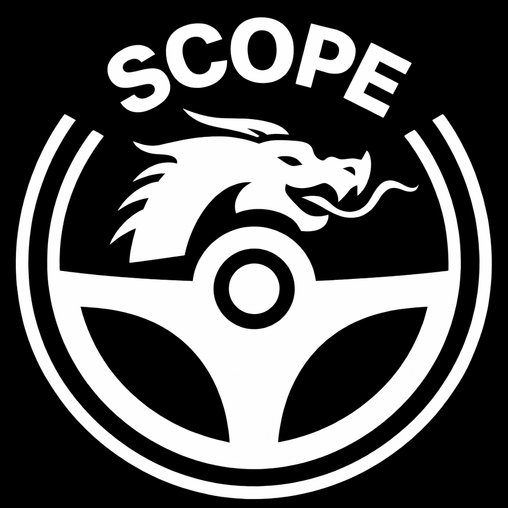

<p align="center">
  
</p>

# opview

**English** | [繁體中文](README_zh-TW.md)

A clone of [openpilot](https://github.com/commaai/openpilot)'s stock onroad UI, built in Flutter for iOS and Android.
No 3D library needed. All projection is pure 3x3 matrix math in Dart.

## Usage

1. Connect your phone to the **same WiFi network** as your comma device
2. Install and open opview
3. Once the device is onroad, you'll see the live road camera with the full openpilot HUD overlay

**Requirements:**
- [openpilot](https://github.com/commaai/openpilot) with webrtcd enabled (see below), or [dragonpilot](https://github.com/dragonpilot-community/dragonpilot) 0.10.3+
- Phone and comma device on the same local network
- The comma device's `webrtcd` service must be reachable on port 5001 (default on stock openpilot)

**Enabling webrtcd on stock openpilot:**

In `selfdrive/manager/process_config.py`, find the `webrtcd` and `stream_encoderd` entries and change their condition from `notcar` to `or_(notcar, only_onroad)`:
```python
PythonProcess("webrtcd", "system.webrtc.webrtcd", or_(notcar, only_onroad)),
NativeProcess("stream_encoderd", "system/loggerd", ["./encoderd", "--stream"], or_(notcar, only_onroad)),
```

## Architecture

```
├── assets/
│   └── logo.png                           # Source icon (generates all app icons)
├── scripts/
│   ├── build.sh                           # Build script (Android/iOS)
│   └── generate_icons.py                  # Icon generator from logo.png
├── lib/
│   ├── main.dart                          # Entry point, landscape lock, immersive
│   ├── app.dart                           # MaterialApp shell, lifecycle (pause/resume)
│   ├── common/
│   │   └── transformations.dart           # DEVICE_CAMERAS, rotFromEuler, matmul3x3
│   ├── selfdrive/ui/
│   │   ├── ui_state.dart                  # UIState ChangeNotifier, data-driven refresh
│   │   └── onroad/
│   │       ├── augmented_road_view.dart   # Main screen, layer stack, border, calibration
│   │       ├── model_renderer.dart        # Path, lanes, road edges, lead indicators
│   │       ├── hud_renderer.dart          # Speed display, MAX cruise box, header gradient
│   │       └── alert_renderer.dart        # Severity-colored alert banners
│   ├── system/webrtc/
│   │   ├── webrtc_client.dart             # PeerConnection, H264 SDP preference
│   │   └── webrtcd_api.dart               # POST /stream SDP exchange
│   ├── services/
│   │   ├── discovery.dart                 # Abstract discovery interface
│   │   ├── transport.dart                 # Abstract transport interface
│   │   ├── adapter.dart                   # Abstract telemetry adapter interface
│   │   ├── connection_manager.dart        # Discovery → Transport → Adapter → UIState
│   │   ├── wake_lock_service.dart         # Screen wake lock toggle (platform channel)
│   │   └── impl/
│   │       ├── mdns_discovery.dart        # mDNS/NSD auto-discovery (Bonjour)
│   │       ├── webrtc_transport.dart      # WebRTC video + data channel
│   │       └── cereal_adapter.dart        # }{ split, NaN sanitize, JSON decode
│   └── data/
│       └── models.dart                    # StreamRequest
└── test/
    ├── transformations_test.dart          # Matrix math, camera configs
    ├── telemetry_parser_test.dart         # (stub)
    ├── ui_state_test.dart                 # All apply methods, derived values
    ├── sdp_test.dart                      # H264 SDP rewriting
    └── models_test.dart                   # Data model serialization
```

## Build

Requires Flutter 3.x.

```bash
# Quick build
scripts/build.sh           # Android (default)
scripts/build.sh ios       # iOS (requires macOS + Xcode)

# Or manually
flutter build apk --release
flutter build ios --release
```

## Platform Notes

- **Android phones/tablets** — works out of the box
- **Android headunits** — works, `minSdk 21` covers most aftermarket units
- **iOS** — not yet test built, Bonjour entitlements pre-configured in Info.plist
- **Android Auto / Apple CarPlay** — not supported. Both platforms restrict apps to navigation, media, messaging, or EV charging categories and enforce template-based UIs with no custom rendering surfaces

## Branches

| Branch | Description |
|--------|-------------|
| `main` | Stable release |
| `perf-optimizations` | Experimental performance improvements |

### perf-optimizations

Performance tweaks for lower CPU/GPU usage on constrained devices:

- **Simplified lane lines** — stroked lines instead of filled polygons
- **Simplified road edges** — stroked lines instead of filled polygons
- **Simplified exp gradient** — 5 sample points instead of per-point gradient

Toggle via constants in `model_renderer.dart`:
```dart
const useSimpleLaneLines = true;
const useSimpleRoadEdges = true;
const useSimpleExpGradient = true;
```

## Ported From

| Source | What |
|--------|------|
| `openpilot/selfdrive/ui/` | UIState, augmented_road_view, model_renderer, hud_renderer, alert_renderer |
| `openpilot/common/transformations/` | Camera intrinsics, rotFromEuler, view_frame_from_device_frame |
| `openpilot/system/webrtc/webrtcd.py` | POST /stream API, data channel format |
| `dashy` | Video-scale-aware calibration, H264 SDP rewriting, NaN handling, }{ splitting, NSD discovery |

## License

See [LICENSE](LICENSE).
